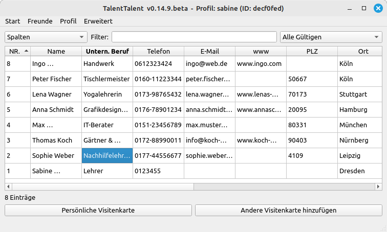
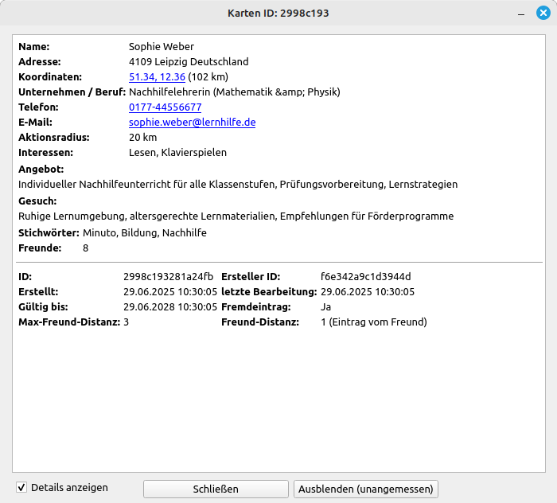
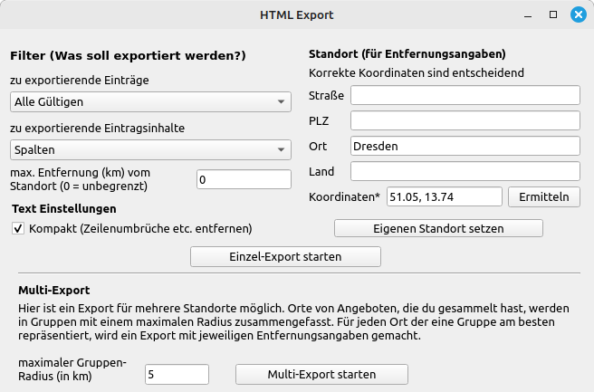
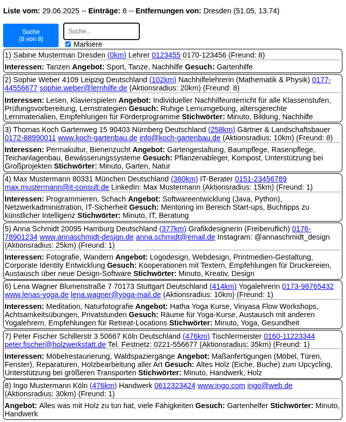

# TalentTalent

TalentTalent ist ein dezentralisiertes Programm zur Sammlung von Fähigkeiten von Menschen in Form digitaler Visitenkarten. Das einzigartige Konzept ermöglicht es jedem Nutzer, Fähigkeiten in seinem Netzwerk zu sammeln und sich mit anderen zu vernetzen, die dasselbe tun, und so eine größere verteilte dezentralisierte Datenbank zu erstellen.

## Download

**[Laden Sie hier die neueste Version herunter](https://github.com/minutogit/TalentTalent/releases/latest)**

## Funktionen

  - **Digitale ID**: Jeder Nutzer, der Fähigkeiten sammelt, erstellt beim Start des Programms eine digitale ID. Mit dieser ID werden die Einträge digital signiert, um sie vor Fälschungen zu schützen und ihre Herkunft nachverfolgen zu können.
  - **Sicherheit**: Bei Programmstart wird ein Passwort zur Sicherheit abgefragt.
  - **Kontrolliertes Teilen**: Für jeden Eintrag kann festgelegt werden, über wie viele Hops (Freund von Freund usw.) die Einträge geteilt werden dürfen, um die Größe der verteilten Datenbank zu begrenzen.
  - **Inhaltliche Moderation**: Einträge von anderen Sammlern können ausgeblendet werden, wenn sie unangemessen erscheinen.
  - **Suchen & Filtern**: Die Einträge können mit Hilfe des Programms nach Inhalten gefiltert bzw. durchsucht werden.
  - **Sortierung nach Standort**: Die Einträge können einfach mit Koordinaten versehen werden, um sie nach Entfernung vom eigenen Standort sortieren zu können.
  - **E-Mail-Integration**: Jeder Eintrag enthält die Möglichkeit, eine E-Mail-Adresse einzutragen, und es gibt eine Hilfsfunktion, um die Einträge an alle eingetragenen E-Mail-Adressen zu versenden.
  - **Verschlüsseltes Teilen**: Wenn die eigene Datenbank an Freunde verschickt wird, erfolgt dies verschlüsselt, so dass nur Freunde die Daten entschlüsseln und importieren können.
  - **Personalisierte Sammlung**: Jeder Nutzer verwaltet seine eigenen Einträge und behält die Fähigkeiten und Talente in seinem Netzwerk im Auge.
  - **Soziale Vernetzung**: Vernetzen Sie sich mit anderen TalentSammlern in anderen Netzwerken, teilen und erweitern Sie Ihre Datenbank mit deren Datenbank.
  - **Dynamische Aktualisierungen**: Bei Änderungen oder neuen Einträgen können Sie die aktualisierten Daten mit Ihren vernetzten Freunden teilen.
  - **Ablaufsystem**: Um die Relevanz der Datenbank zu gewährleisten, hat jeder Eintrag ein Ablaufdatum, um langfristig verwaiste Einträge zu vermeiden.
  - **Exportierbarkeit**: Die Einträge können im HTML-Format exportiert werden, um sie leicht ausdrucken oder per E-Mail an interessierte Parteien weitergeben zu können.

### Screenshots

Hier sind einige Bilder von TalentTalent in Aktion:

-----

**Hauptfenster**

-----

**Visitenkartenansicht**

-----

**HTML Export Ansicht**

-----

**Exportierte Visitenkarten durchsuchbar im HTML Format**

-----

## Lizenz

TalentTalent ist unter den Bedingungen der MIT-Lizenz lizenziert.

-----

# TalentTalent

TalentTalent is a decentralized program for aggregating human skills in the form of digital business cards. The unique concept allows each user to gather skills within their network and connect with other individuals doing the same, creating a larger distributed decentralized database.

## Download

**[Download the latest version here](https://github.com/minutogit/TalentTalent/releases/latest)**

## Features

  - **Digital ID**: Every user, who collects skills, creates a digital ID when the program starts. With this ID, entries are digitally signed, making them secure against forgery and traceable to their origin.
  - **Security**: At the start of the program, a password is requested for security.
  - **Controlled Sharing**: For each entry, it can be determined how many hops (friend of a friend, etc.) the entries may be shared to limit the size of the distributed database.
  - **Content Moderation**: Entries from other collectors can be hidden if they appear inappropriate.
  - **Search & Filter**: The entries can be filtered or searched for content using the program.
  - **Location Sorting**: Entries can be easily labeled with coordinates to sort by distance from one's own location.
  - **Email Integration**: Every entry includes the option to add an email address, and there is a helper to send the entries to all registered emails.
  - **Encrypted Sharing**: When your own database is sent to friends, it is encrypted so that only friends can decrypt and import the data.
  - **Personalized Collection**: Each user manages their own entries, keeping track of the skills and talents within their network.
  - **Social Connectivity**: Connect with other skill collectors in other networks, sharing and growing your database with theirs.
  - **Dynamic Updates**: Whenever there are changes or new entries, you can share the updated data with your connected friends.
  - **Expiry System**: To ensure the database remains relevant, each entry has an expiration date to prevent orphan entries long term.
  - **Exportability**: The entries can be exported in HTML format for easy printing or sharing via email with interested parties.

### Screenshots

Here are some visuals of TalentTalent in action:

-----

**Main window**

-----

**Business card view**

-----

**HTML export view**

-----

**Exported business cards searchable in HTML format**

-----

## License

TalentTalent is licensed under the terms of the MIT License.
